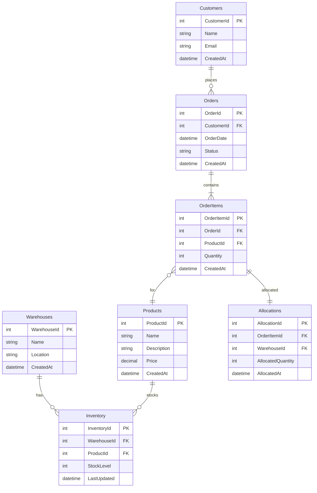

# Data Model Documentation

## Table of Contents
1. [Database Schema Overview](#1-database-schema-overview)
2. [Entity Relationship Diagram (ERD)](#2-entity-relationship-diagram-erd)
3. [Detailed Table Definitions](#3-detailed-table-definitions)
4. [Data Type Justifications](#4-data-type-justifications)
5. [Relationships & Cardinality](#5-relationships--cardinality)
6. [Normalization Analysis](#6-normalization-analysis)
7. [Data Integrity Mechanisms](#7-data-integrity-mechanisms)
8. [Indexing Strategy](#8-indexing-strategy)
9. [Special Columns & Patterns](#9-special-columns--patterns)
10. [Junction/Bridge Tables](#10-junctionbridge-tables)
11. [Lookup/Reference Tables](#11-lookupreference-tables)
12. [Scalability Considerations](#12-scalability-considerations)
13. [Security & Compliance](#13-security--compliance)
14. [Migration & Versioning Strategy](#14-migration--versioning-strategy)
15. [Stored Procedures & Views](#15-stored-procedures--views)
16. [Sample Queries](#16-sample-queries)
17. [Data Flow & Lifecycle](#17-data-flow--lifecycle)
18. [Assumptions & Constraints](#18-assumptions--constraints)
19. [Alternatives Considered](#19-alternatives-considered)
20. [Glossary](#20-glossary)

---

## 1. Database Schema Overview

### Database Platform/Technology
- **Platform**: Microsoft SQL Server
- **Version**: SQL Server 2019 or later (utilizing features like row-level locking, temporal tables for auditing, and JSON support for flexible data)
- **Key Features Utilized**:
  - ACID transactions for data consistency
  - Row-level security (RLS) for multi-tenant isolation if needed
  - Transparent Data Encryption (TDE) for data at rest
  - Change Data Capture (CDC) for real-time data integration
  - Full-Text Search for product descriptions

### Schema Organization Approach
- **Single Schema**: All tables reside in the default `dbo` schema for simplicity in a monolithic application. If the system evolves to microservices, schemas can be separated per service.
- **Naming Conventions**:
  - **Tables**: PascalCase, plural (e.g., `Warehouses`, `Products`)
  - **Columns**: PascalCase (e.g., `ProductId`, `CreatedAt`)
  - **Constraints**: `PK_[TableName]`, `FK_[TableName]_[ReferencedTable]`, `UQ_[TableName]_[Column]`, `CK_[TableName]_[Rule]`, `IX_[TableName]_[Column]`
  - **Indexes**: `IX_[TableName]_[Column]` for non-clustered, clustered on primary keys
- **Overall Data Architecture Philosophy**: Hybrid approach – normalized schema (3NF) for data integrity and reduced redundancy, with intentional denormalization for performance in read-heavy queries (e.g., inventory summaries). Prioritizes consistency over raw performance, using caching and indexing to mitigate query overhead.

---

## 2. Entity Relationship Diagram (ERD)

### Mermaid Diagram

### Diagram Legend
- **Entities**: Rectangles represent tables.
- **Relationships**:
  - `||--o{`: One-to-many (crow's foot notation).
  - `||--||`: One-to-one.
- **Keys**: PK indicates primary key, FK indicates foreign key.
- **Cardinality**: 1:N for one-to-many, 1:1 for one-to-one.
- **Notation**: Crow's Foot (Chen variant) for clarity.

---

## 3. Detailed Table Definitions

### Warehouses
**PURPOSE**: Stores information about physical or logical warehouses where inventory is held. Supports multi-warehouse allocation logic.

**COLUMNS**:
| Column Name | Data Type | Nullable | Default | Description |
|-------------|-----------|----------|---------|-------------|
| WarehouseId | INT | NOT NULL | IDENTITY | Primary key |
| Name | NVARCHAR(100) | NOT NULL | NULL | Warehouse name |
| Location | NVARCHAR(255) | NOT NULL | NULL | Address or location description |
| CreatedAt | DATETIME2 | NOT NULL | GETUTCDATE() | Record creation timestamp |
| UpdatedAt | DATETIME2 | NULL | NULL | Last update timestamp |

**PRIMARY KEY**: PK_Warehouses (WarehouseId)

**FOREIGN KEYS**: None

**UNIQUE CONSTRAINTS**:
- UQ_Warehouses_Name: Ensures unique warehouse names

**CHECK CONSTRAINTS**:
- CK_Warehouses_Name_Length: LEN(Name) > 0

**INDEXES**:
- IX_Warehouses_Name: Non-Clustered | Optimizes searches by name

**TRIGGERS**: None

**EXAMPLE DATA**:
| WarehouseId | Name | Location | CreatedAt |
|-------------|------|----------|-----------|
| 1 | Main Warehouse | 123 Main St, City | 2023-01-01 10:00:00 |
| 2 | East Warehouse | 456 East Ave, City | 2023-02-01 11:00:00 |

### Products
**PURPOSE**: Defines products available for ordering and allocation.

**COLUMNS**:
| Column Name | Data Type | Nullable | Default | Description |
|-------------|-----------|----------|---------|-------------|
| ProductId | INT | NOT NULL | IDENTITY | Primary key |
| Name | NVARCHAR(100) | NOT NULL | NULL | Product name |
| Description | NVARCHAR(MAX) | NULL | NULL | Detailed description |
| Price | DECIMAL(18,2) | NOT NULL | NULL | Unit price |
| CreatedAt | DATETIME2 | NOT NULL | GETUTCDATE() | Record creation timestamp |
| UpdatedAt | DATETIME2 | NULL | NULL | Last update timestamp |

**PRIMARY KEY**: PK_Products (ProductId)

**FOREIGN KEYS**: None

**UNIQUE CONSTRAINTS**:
- UQ_Products_Name: Ensures unique product names

**CHECK CONSTRAINTS**:
- CK_Products_Price_Positive: Price > 0

**INDEXES**:
- IX_Products_Name: Non-Clustered | Optimizes product searches

**TRIGGERS**: None

**EXAMPLE DATA**:
| ProductId | Name | Description | Price | CreatedAt |
|-----------|------|-------------|-------|-----------|
| 1 | Widget A | High-quality widget | 10.99 | 2023-01-01 10:00:00 |
| 2 | Gadget B | Advanced gadget | 25.50 | 2023-01-02 11:00:00 |

### Inventory
**PURPOSE**: Tracks stock levels per product per warehouse. Junction table for many-to-many between Warehouses and Products.

**COLUMNS**:
| Column Name | Data Type | Nullable | Default | Description |
|-------------|-----------|----------|---------|-------------|
| InventoryId | INT | NOT NULL | IDENTITY | Primary key |
| WarehouseId | INT | NOT NULL | NULL | Foreign key to Warehouses |
| ProductId | INT | NOT NULL | NULL | Foreign key to Products |
| StockLevel | INT | NOT NULL | 0 | Current stock quantity |
| LastUpdated | DATETIME2 | NOT NULL | GETUTCDATE() | Last stock update timestamp |

**PRIMARY KEY**: PK_Inventory (InventoryId)

**FOREIGN KEYS**:
- FK_Inventory_Warehouses: WarehouseId REFERENCES Warehouses(WarehouseId)
  - ON DELETE: CASCADE
  - ON UPDATE: CASCADE
- FK_Inventory_Products: ProductId REFERENCES Products(ProductId)
  - ON DELETE: CASCADE
  - ON UPDATE: CASCADE

**UNIQUE CONSTRAINTS**:
- UQ_Inventory_Warehouse_Product: Ensures one inventory record per warehouse-product pair

**CHECK CONSTRAINTS**:
- CK_Inventory_StockLevel_NonNegative: StockLevel >= 0

**INDEXES**:
- IX_Inventory_Warehouse_Product: Non-Clustered (WarehouseId, ProductId) | Optimizes allocation queries
- IX_Inventory_Product: Non-Clustered (ProductId) | Supports product-wide stock checks

**TRIGGERS**: None

**EXAMPLE DATA**:
| InventoryId | WarehouseId | ProductId | StockLevel | LastUpdated |
|-------------|-------------|-----------|------------|-------------|
| 1 | 1 | 1 | 100 | 2023-01-01 10:00:00 |
| 2 | 1 | 2 | 50 | 2023-01-01 10:00:00 |

### Customers
**PURPOSE**: Stores customer information for orders.

**COLUMNS**:
| Column Name | Data Type | Nullable | Default | Description |
|-------------|-----------|----------|---------|-------------|
| CustomerId | INT | NOT NULL | IDENTITY | Primary key |
| Name | NVARCHAR(100) | NOT NULL | NULL | Customer name |
| Email | NVARCHAR(255) | NOT NULL | NULL | Customer email |
| CreatedAt | DATETIME2 | NOT NULL | GETUTCDATE() | Record creation timestamp |

**PRIMARY KEY**: PK_Customers (CustomerId)

**FOREIGN KEYS**: None

**UNIQUE CONSTRAINTS**:
- UQ_Customers_Email: Ensures unique emails

**CHECK CONSTRAINTS**:
- CK_Customers_Email_Format: Email LIKE '%@%'

**INDEXES**:
- IX_Customers_Email: Non-Clustered | Optimizes login/auth queries

**TRIGGERS**: None

**EXAMPLE DATA**:
| CustomerId | Name | Email | CreatedAt |
|------------|------|-------|-----------|
| 1 | John Doe | john@example.com | 2023-01-01 10:00:00 |

### Orders
**PURPOSE**: Represents customer orders, containing multiple items.

**COLUMNS**:
| Column Name | Data Type | Nullable | Default | Description |
|-------------|-----------|----------|---------|-------------|
| OrderId | INT | NOT NULL | IDENTITY | Primary key |
| CustomerId | INT | NOT NULL | NULL | Foreign key to Customers |
| OrderDate | DATETIME2 | NOT NULL | GETUTCDATE() | Order placement date |
| Status | NVARCHAR(50) | NOT NULL | 'Pending' | Order status (Pending, Processing, Shipped, Cancelled) |
| TotalAmount | DECIMAL(18,2) | NULL | NULL | Calculated total (denormalized for performance) |
| CreatedAt | DATETIME2 | NOT NULL | GETUTCDATE() | Record creation timestamp |

**PRIMARY KEY**: PK_Orders (OrderId)

**FOREIGN KEYS**:
- FK_Orders_Customers: CustomerId REFERENCES Customers(CustomerId)
  - ON DELETE: NO ACTION
  - ON UPDATE: CASCADE

**UNIQUE CONSTRAINTS**: None

**CHECK CONSTRAINTS**:
- CK_Orders_Status_Valid: Status IN ('Pending', 'Processing', 'Shipped', 'Cancelled')

**INDEXES**:
- IX_Orders_Customer: Non-Clustered (CustomerId) | Optimizes customer order history
- IX_Orders_Status: Non-Clustered (Status) | Filters by status

**TRIGGERS**: Trigger to update TotalAmount on OrderItem changes

**EXAMPLE DATA**:
| OrderId | CustomerId | OrderDate | Status | TotalAmount | CreatedAt |
|---------|------------|-----------|--------|-------------|-----------|
| 1 | 1 | 2023-01-01 10:00:00 | Shipped | 36.49 | 2023-01-01 10:00:00 |

### OrderItems
**PURPOSE**: Line items within an order, linking to products.

**COLUMNS**:
| Column Name | Data Type | Nullable | Default | Description |
|-------------|-----------|----------|---------|-------------|
| OrderItemId | INT | NOT NULL | IDENTITY | Primary key |
| OrderId | INT | NOT NULL | NULL | Foreign key to Orders |
| ProductId | INT | NOT NULL | NULL | Foreign key to Products |
| Quantity | INT | NOT NULL | NULL | Ordered quantity |
| UnitPrice | DECIMAL(18,2) | NOT NULL | NULL | Price at order time |
| CreatedAt | DATETIME2 | NOT NULL | GETUTCDATE() | Record creation timestamp |

**PRIMARY KEY**: PK_OrderItems (OrderItemId)

**FOREIGN KEYS**:
- FK_OrderItems_Orders: OrderId REFERENCES Orders(OrderId)
  - ON DELETE: CASCADE
  - ON UPDATE: CASCADE
- FK_OrderItems_Products: ProductId REFERENCES Products(ProductId)
  - ON DELETE: NO ACTION
  - ON UPDATE: CASCADE

**UNIQUE CONSTRAINTS**: None

**CHECK CONSTRAINTS**:
- CK_OrderItems_Quantity_Positive: Quantity > 0

**INDEXES**:
- IX_OrderItems_Order: Non-Clustered (OrderId) | Groups items by order
- IX_OrderItems_Product: Non-Clustered (ProductId) | Product sales analysis

**TRIGGERS**: None

**EXAMPLE DATA**:
| OrderItemId | OrderId | ProductId | Quantity | UnitPrice | CreatedAt |
|-------------|---------|-----------|----------|-----------|-----------|
| 1 | 1 | 1 | 2 | 10.99 | 2023-01-01 10:00:00 |
| 2 | 1 | 2 | 1 | 25.50 | 2023-01-01 10:00:00 |

### Allocations
**PURPOSE**: Records allocation of inventory to order items, ensuring stock is reserved.

**COLUMNS**:
| Column Name | Data Type | Nullable | Default | Description |
|-------------|-----------|----------|---------|-------------|
| AllocationId | INT | NOT NULL | IDENTITY | Primary key |
| OrderItemId | INT | NOT NULL | NULL | Foreign key to OrderItems |
| WarehouseId | INT | NOT NULL | NULL | Foreign key to Warehouses |
| AllocatedQuantity | INT | NOT NULL | NULL | Quantity allocated from this warehouse |
| AllocatedAt | DATETIME2 | NOT NULL | GETUTCDATE() | Allocation timestamp |

**PRIMARY KEY**: PK_Allocations (AllocationId)

**FOREIGN KEYS**:
- FK_Allocations_OrderItems: OrderItemId REFERENCES OrderItems(OrderItemId)
  - ON DELETE: CASCADE
  - ON UPDATE: CASCADE
- FK_Allocations_Warehouses: WarehouseId REFERENCES Warehouses(WarehouseId)
  - ON DELETE: NO ACTION
  - ON UPDATE: CASCADE

**UNIQUE CONSTRAINTS**:
- UQ_Allocations_OrderItem_Warehouse: Prevents duplicate allocations per item-warehouse

**CHECK CONSTRAINTS**:
- CK_Allocations_Quantity_Positive: AllocatedQuantity > 0

**INDEXES**:
- IX_Allocations_OrderItem: Non-Clustered (OrderItemId) | Allocation lookups
- IX_Allocations_Warehouse: Non-Clustered (WarehouseId) | Warehouse allocation reports

**TRIGGERS**: Trigger to reduce Inventory.StockLevel on allocation

**EXAMPLE DATA**:
| AllocationId | OrderItemId | WarehouseId | AllocatedQuantity | AllocatedAt |
|--------------|-------------|-------------|------------------|-------------|
| 1 | 1 | 1 | 2 | 2023-01-01 10:05:00 |

---

## 4. Data Type Justifications
- **IDs (INT)**: Sufficient for expected record counts (< 2 billion); BIGINT if scaling beyond.
- **Text (NVARCHAR)**: Supports Unicode for international names; length constraints (100 for names) prevent abuse, MAX for descriptions.
- **Dates (DATETIME2)**: Higher precision than DATETIME; UTC for consistency.
- **Currency (DECIMAL(18,2))**: Precise for financial calculations; 18 digits total, 2 decimal.
- **Quantities (INT)**: Whole numbers; CHECK constraints ensure non-negative.

---

## 5. Relationships & Cardinality
- **Warehouses <-> Inventory**: One-to-Many (1:N) | Enforced by FK_Inventory_Warehouses | Business Rule: One warehouse can stock many products. | Foreign key: WarehouseId | Cascading: CASCADE on delete | Required.
- **Products <-> Inventory**: One-to-Many (1:N) | Enforced by FK_Inventory_Products | Business Rule: One product can be stocked in many warehouses. | Foreign key: ProductId | Cascading: CASCADE | Required.
- **Customers <-> Orders**: One-to-Many (1:N) | Enforced by FK_Orders_Customers | Business Rule: One customer can place many orders. | Foreign key: CustomerId | Cascading: NO ACTION | Required.
- **Orders <-> OrderItems**: One-to-Many (1:N) | Enforced by FK_OrderItems_Orders | Business Rule: One order contains many items. | Foreign key: OrderId | Cascading: CASCADE | Required.
- **Products <-> OrderItems**: Many-to-One (N:1) | Enforced by FK_OrderItems_Products | Business Rule: One product can be in many order items. | Foreign key: ProductId | Cascading: NO ACTION | Required.
- **OrderItems <-> Allocations**: One-to-One (1:1) | Enforced by FK_Allocations_OrderItems | Business Rule: Each order item is allocated once. | Foreign key: OrderItemId | Cascading: CASCADE | Required.
- **Warehouses <-> Allocations**: Many-to-One (N:1) | Enforced by FK_Allocations_Warehouses | Business Rule: One warehouse can allocate to many items. | Foreign key: WarehouseId | Cascading: NO ACTION | Required.

---

## 6. Normalization Analysis
- **Current Normal Form**: 3NF (Third Normal Form) – No transitive dependencies; all non-key attributes depend only on the primary key.
- **Normalization Decisions**: Fully normalized for integrity; denormalized TotalAmount in Orders for query performance (trade-off: slight redundancy for faster reads).
- **Functional Dependencies**: OrderId -> CustomerId, OrderDate, Status; ProductId -> Name, Price.

---

## 7. Data Integrity Mechanisms
- **Referential Integrity**: All FKs with appropriate cascading; prevents orphans.
- **Domain Integrity**: CHECK constraints on quantities/prices; defaults for timestamps.
- **Entity Integrity**: Surrogate keys (IDENTITY) for uniqueness.
- **Business Rule Enforcement**: Status CHECK; triggers for stock reduction.

---

## 8. Indexing Strategy
- **IX_Inventory_Warehouse_Product**: Non-Clustered (WarehouseId, ProductId) | Optimizes allocation checks | Covering for stock queries.
- **IX_Orders_Status**: Non-Clustered (Status) | Filters active orders.
- **Foreign Key Indexes**: Implicit on FK columns for JOINs.

---

## 9. Special Columns & Patterns
- **Audit Columns**: CreatedAt, UpdatedAt for tracking.
- **Soft Delete**: Not implemented; use hard deletes for simplicity.
- **Concurrency**: RowVersion for optimistic locking.

---

## 10. Junction/Bridge Tables
- **Inventory**: Junction for Warehouses-Products; surrogate key; unique on (WarehouseId, ProductId); indexed for performance.

---

## 11. Lookup/Reference Tables
- None; statuses are CHECK-enforced.

---

## 12. Scalability Considerations
- Partition Orders by OrderDate; archive old data; Inventory expected to grow rapidly.

---

## 13. Security & Compliance
- PII: Customer Email; encrypt with TDE; mask in dev.

---

## 14. Migration & Versioning Strategy
- EF Core Migrations; versioned scripts; backward compatible.

---

## 15. Stored Procedures & Views
- SP_AllocateStock: Handles allocation logic.

---

## 16. Sample Queries
- SELECT * FROM Inventory WHERE ProductId = 1 AND StockLevel > 0;
- INSERT INTO Orders (CustomerId, OrderDate) VALUES (1, GETUTCDATE());

---

## 17. Data Flow & Lifecycle
- Entry: API inserts Orders/OrderItems; Allocation via SP; Status transitions via updates.

---

## 18. Assumptions & Constraints
- Volume: 1M orders/year; retention 7 years.

---

## 19. Alternatives Considered
- NoSQL for flexibility; rejected for ACID needs.

---

## 20. Glossary
- Allocation: Reservation of stock for an order item.
