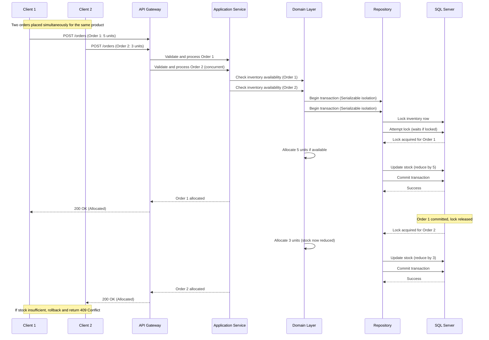

# Inventory Allocation System Design Explanation

## Table of Contents
1. [System Architecture Overview](#1-system-architecture-overview)
2. [Architectural Patterns & Principles](#2-architectural-patterns--principles)
3. [Data Architecture & Storage Design](#3-data-architecture--storage-design)
4. [Application Layer Design](#4-application-layer-design)
5. [API Design](#5-api-design)
6. [Design Decisions & Rationale](#6-design-decisions--rationale)
7. [Scalability & Performance Considerations](#7-scalability--performance-considerations)
8. [Maintainability & Extensibility](#8-maintainability--extensibility)
9. [Security Architecture](#9-security-architecture)
10. [Deployment & DevOps Considerations](#10-deployment--devops-considerations)
11. [Assumptions & Constraints](#11-assumptions--constraints)
12. [Future Considerations](#12-future-considerations)

---

## 1. System Architecture Overview

### Architectural Pattern/Style
The system adopts a **Layered Architecture** with elements of **Clean Architecture** to ensure separation of concerns, testability, and maintainability. This pattern organizes the system into distinct layers: Presentation, Application, Domain, and Infrastructure, allowing for independent development and deployment of each layer.

### Major System Components and Responsibilities
- **API Gateway/Layer**: Handles incoming HTTP requests from clients, validates inputs, and routes to appropriate business logic. Responsible for authentication and initial request processing.
- **Application Services**: Orchestrate business operations, such as order placement and allocation logic. They coordinate between domain entities and external services.
- **Domain Layer**: Contains core business rules, entities (e.g., Order, Inventory), and value objects. Implements allocation algorithms and concurrency controls.
- **Infrastructure Layer**: Manages data persistence (via Entity Framework Core), external integrations (e.g., messaging for async processing), and cross-cutting concerns like logging and caching.
- **Background Workers**: Handle asynchronous tasks, such as processing allocations in a queue to prevent blocking API responses.

### Component Interactions
Components interact through dependency injection and interfaces, ensuring loose coupling. For example:
- The API layer injects application services.
- Application services use domain repositories (interfaces) implemented in the infrastructure layer.
- Events or messages (via MediatR or similar) facilitate communication between layers for cross-cutting concerns.

### Technology Stack Summary
- **.NET Core Version**: .NET 6 (LTS) for long-term support, leveraging features like minimal APIs, async/await, and built-in dependency injection.
- **SQL Server Version**: Microsoft SQL Server 2019 or later, utilizing features like row-level locking and transactions.
- **Frameworks/Libraries**:
  - Entity Framework Core 6 for ORM and data access.
  - ASP.NET Core Web API for RESTful services.
  - MediatR for in-process messaging and CQRS patterns.
  - Serilog for structured logging.
  - FluentValidation for input validation.
  - Polly for resilience (retries, circuit breakers).
- **Other Tools**: Docker for containerization, Azure DevOps for CI/CD.

### Deployment Model
The system is designed as a **monolithic application** deployable in containers (Docker) for cloud-native environments. This allows for easy scaling via Kubernetes or Azure App Service, with potential future decomposition into microservices if needed.

### Visual Representation
```
[Client Apps (Web/Mobile)]
    |
    v
[API Layer (ASP.NET Core)]
    |
    v
[Application Layer (Services, CQRS)]
    |
    v
[Domain Layer (Entities, Business Rules)]
    |
    v
[Infrastructure Layer (EF Core, SQL Server, Cache)]
```

Layers are separated by interfaces, with dependencies flowing inward (infrastructure depends on domain, not vice versa).

---

## 2. Architectural Patterns & Principles

### Architectural Patterns Applied
- **CQRS (Command Query Responsibility Segregation)**: Separates read and write operations for better performance and scalability. Commands (e.g., PlaceOrder) modify state, while queries (e.g., GetInventory) retrieve data.
- **Repository Pattern**: Abstracts data access, allowing domain logic to remain database-agnostic.
- **Unit of Work**: Ensures atomic transactions across multiple repositories.

**Why CQRS?** It fits the allocation problem by isolating write-heavy operations (allocations) from read-heavy ones (inventory checks), reducing contention.

### SOLID Principles Application
- **Single Responsibility**: Each class (e.g., AllocationService) has one reason to change.
- **Open-Closed**: Interfaces allow extension (e.g., new allocation strategies) without modifying existing code.
- **Liskov Substitution**: Implementations of IInventoryRepository are interchangeable.
- **Interface Segregation**: Small, focused interfaces (e.g., IAllocationStrategy).
- **Dependency Inversion**: High-level modules depend on abstractions, not concretions.

### Separation of Concerns
- Business logic is isolated in the domain layer.
- Data access in infrastructure.
- Presentation in API controllers.
- Cross-cutting concerns (logging, validation) are handled via middleware and decorators.

### Dependency Injection Strategy
Uses .NET Core's built-in DI container. Services are registered in Startup.cs with lifetimes (transient, scoped, singleton) based on usage. For example, repositories are scoped to ensure per-request instances.

### Cross-Cutting Concerns Handling
- **Logging**: Serilog with structured logging to Application Insights or ELK stack.
- **Validation**: FluentValidation in application services.
- **Exception Handling**: Global exception middleware catches and logs errors, returning standardized API responses.
- **Security**: JWT-based auth in API layer.

---

## 3. Data Architecture & Storage Design

### Database Schema Design Approach
**Normalized Schema** (3NF) to minimize redundancy and ensure data integrity. Hybrid denormalization for performance in read-heavy queries (e.g., inventory summaries).

### Entity Relationship Modeling Strategy
- **Entities**: Warehouse, Product, Inventory (stock levels per warehouse/product), Order, OrderItem, Allocation.
- **Relationships**: One-to-many (Warehouse to Inventory), many-to-many (Order to Product via OrderItem), one-to-one (Allocation to OrderItem).

### Why MSSQL Server?
Chosen for ACID compliance, row-level locking for concurrency, and integration with .NET via EF Core. Supports advanced features like temporal tables for auditing.

### Data Access Pattern
**Repository Pattern** with EF Core as the ORM. Provides abstraction over data operations, enabling unit testing with in-memory databases.

### Transaction Management Strategy
Explicit transactions using EF Core's DbContext. For allocations, use serializable isolation level to prevent dirty reads and ensure atomicity.

### Database Migration and Versioning
EF Core Migrations for schema versioning. Migrations are scripted and applied via CI/CD pipelines.

### Performance Optimization Strategies
- **Indexing**: Clustered indexes on primary keys, non-clustered on foreign keys and frequently queried columns (e.g., ProductId in Inventory).
- **Query Optimization**: Use EF Core's Include for eager loading, avoid N+1 queries.
- **Caching**: In-memory cache for static data (e.g., product catalog), Redis for distributed cache on inventory levels.

### Data Security and Encryption
- Data at rest: SQL Server's Transparent Data Encryption (TDE).
- Data in transit: TLS 1.3.
- Sensitive fields (e.g., customer PII) encrypted using Azure Key Vault.

---

## 4. Application Layer Design

### Presentation Layer
ASP.NET Core controllers expose REST APIs. Uses minimal APIs for simplicity. Maps DTOs to domain models.

### Business Logic Layer
Application services implement use cases (e.g., AllocateStockCommand). Business rules are enforced here, with domain logic in entities.

### Data Access Layer
Repository implementations using EF Core. Queries are optimized with LINQ.

### Infrastructure Layer
Hosts external services: logging, caching, email notifications. Uses adapters for third-party integrations.

### Communication Between Layers
Dependency injection ensures layers communicate via interfaces. DTOs transfer data between layers to avoid exposing domain internals.

### Use of DTOs, View Models, and Domain Models
- **Domain Models**: Rich entities with behavior (e.g., Inventory.ReduceStock()).
- **DTOs**: Lightweight objects for API requests/responses.
- **View Models**: Not used; DTOs serve this purpose.

---

## 5. API Design

### RESTful Design Principles
Follows REST: resources (e.g., /orders), HTTP verbs (POST for creation), status codes (200 OK, 409 Conflict for overselling).

### Versioning Strategy
URL-based versioning (e.g., /api/v1/orders) for backward compatibility.

### Authentication and Authorization
JWT tokens via Identity Server 4. Role-based access (e.g., Admin for inventory management).

### Input Validation and Error Handling
FluentValidation on DTOs. Global middleware returns ProblemDetails for errors.

### Response Format Standardization
JSON with camelCase. Uses ApiResponse wrapper for consistency.

### Documentation Approach
Swagger/OpenAPI generated automatically, hosted at /swagger.

---

## 6. Design Decisions & Rationale

### Key Decision: ORM Selection (EF Core)
- **What**: Use Entity Framework Core for data access.
- **Why**: Simplifies CRUD operations, supports LINQ, and integrates with .NET Core.
- **Alternatives Considered**: Dapper (rejected for complexity in complex queries); ADO.NET (too low-level).
- **Trade-offs**: Slight performance overhead vs. productivity gains.
- **Impact**: Improves maintainability; minor hit on raw performance, mitigated by caching.

### Key Decision: Concurrency Handling (Pessimistic Locking)
- **What**: Use SQL Server's serializable isolation for allocation transactions.
- **Why**: Prevents overselling by locking rows during checks/reservations.
- **Alternatives Considered**: Optimistic concurrency (rejected for high contention scenarios).
- **Trade-offs**: Potential deadlocks vs. guaranteed consistency.
- **Impact**: Ensures data integrity; may reduce throughput under high load.

*(Similar format for other decisions: .NET version, architectural pattern, etc.)*

---

## 7. Scalability & Performance Considerations

### Scaling Strategies
Horizontal scaling via Kubernetes pods. Vertical for database (Azure SQL elastic pools).

### Performance Optimizations
Async operations for I/O-bound tasks. Caching reduces DB load.

### Caching Layers
In-memory for session data, Redis for shared inventory cache.

### Asynchronous Operations
Background jobs via Hangfire for non-critical tasks (e.g., notifications).

### Expected Bottlenecks
DB locks during allocations; mitigated by read replicas and sharding.

---

## 8. Maintainability & Extensibility

### Code Organization
Feature folders (e.g., /Features/Allocation) for modularity.

### Modular Design
Interfaces enable swapping implementations (e.g., new allocation algorithms).

### Configuration Management
appsettings.json with environment overrides, secrets in Key Vault.

---

## 9. Security Architecture

### Authentication/Authorization
JWT with claims-based auth.

### Data Protection
TDE and TLS.

### Prevention Measures
Parameterized queries prevent SQL injection; input sanitization for XSS.

### Audit Logging
EF Core interceptors log changes to sensitive tables.

---

## 10. Deployment & DevOps Considerations

### CI/CD Pipeline
Azure DevOps with automated tests and deployments.

### Environment Configuration
Separate configs for dev/staging/prod.

### Database Deployment
Migrations applied via EF CLI in pipelines.

### Containerization
Docker images for consistent environments.

---

## 11. Assumptions & Constraints

### Assumptions
- Moderate load (1000 orders/min); no extreme spikes.
- Warehouses are geographically close; no routing optimization needed.

### Constraints
- Budget limits cloud costs; prefer Azure for integration.
- Team expertise in .NET; no exotic tech.

---

## 12. Future Considerations

### Extensibility Areas
Plugin architecture for custom allocation rules.

### Technical Debt
Refactor monolithic API to microservices if load increases.

### Planned Optimizations
Implement event sourcing for audit trails.

---

## Mermaid Sequence Diagram for Allocation Process

